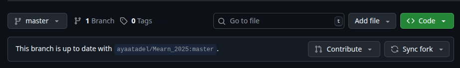

# Fork Task
---
## Update Fork From original branch (upstream)
- Using GitHub `Sync Fork` Button in Fork page to sync directly as shown the image below.  

- Using git commands locally and pushing edits to remote as shown below ==>  
    1. navigate to local fork repo  

    2. Add the Upstream Remote (original repo) as new remote ==>  
    `git remote add upstream https://github.com/ayaatadel/Mearn_2025.git`  
    Verify it's added by running ==> `git remote -v`  
    expected output ==>  
            `origin  https://github.com/mearn-2025-i-samir/Mearn_2025.git (fetch)`  
            `origin  https://github.com/mearn-2025-i-samir/Mearn_2025.git (push)`  
            `upstream        https://github.com/ayaatadel/Mearn_2025.git (fetch)`  
            `upstream        https://github.com/ayaatadel/Mearn_2025.git (push)`  

    3. Fetch Upstream Changes: To get the latest commits from the original repository  
    `git fetch upstream`  

    4. Merge changes into Your branch (ex: 'master')  
    `git checkout master`  
    `git merge upstream/master`  

    5. Push to Your Fork: Now, push the merged changes from your local repository to your fork on GitHub.  
    `git push origin master`  

    ---

## Update upstream from fork